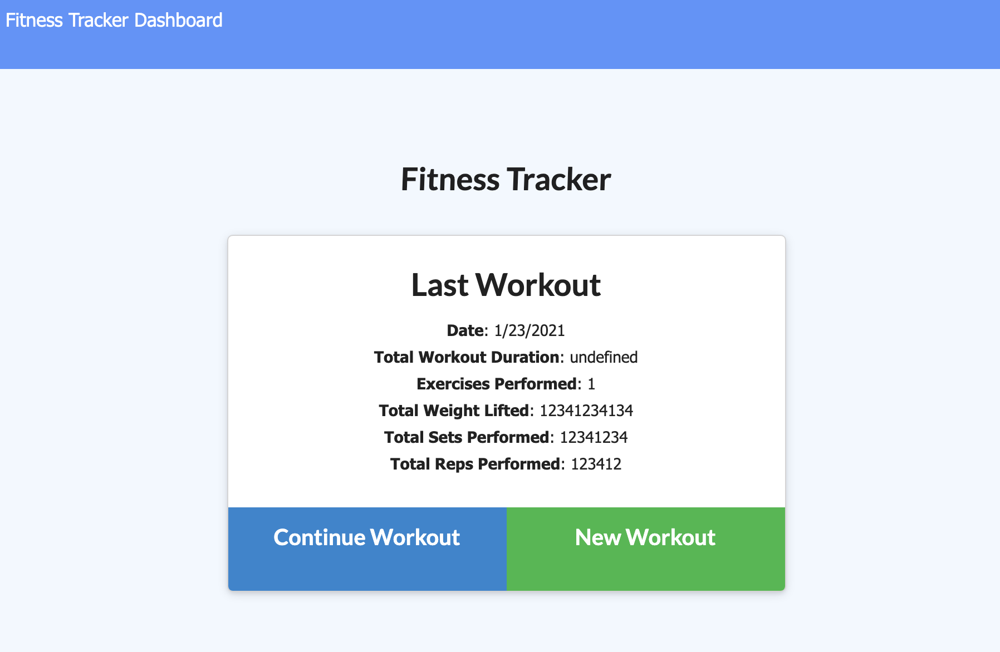

# Workout Tracker

## Table of Contents
[Description](#description)  
[Installation](#Installation)  
[Test](#Testing)  
[Project Links](#live-Site-and-Repo)  
[License](#License)  
[Contributors](#Contributors)  

## Description
* This is an app that allows you to track different aspects of your workouts

## Installation
* Npm i, npm run watch to use on local server || use deployed app on heroku service.

## Testing
* No testing available

## Live Site and Repo
* [live Site](https://ajl-workout-tracker.herokuapp.com/exercise)
* [Repo](https://github.com/ajlaursen/ajl-workout-tracker)

## License
* 

## Contributors
* Contributor: [Alex Laursen](https://github.com/ajlaursen) Email: [contact@ajlaursen.codes](mailto:contact@ajlaursen.codes)

